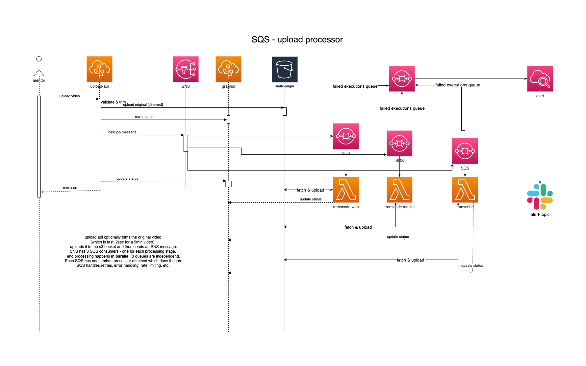

# Intro

This is a serverless service that can transcode and transcribe mentorpal answer uploads:



# Deployment

There's no cicd pipeline yet. To deploy manually first run once `npm ci` to get all the tools and then:

```
sls deploy -s <stage>
# where stage is one of dev|qa|prod
```

# Monitoring

All lambdas use sentry to report issues. If processing fails, SQS will move messages to corresponding DLQ,
and there're alarms that monitor DLQs and send message to alerting topic (currently forwards to slack).

# Troubleshooting

To retry processing after fixing a bug, go to 
(AWS SQS console)[https://console.aws.amazon.com/sqs/v2/home?region=us-east-1#/queues]
pick appropriate DLQ and poll for messages. Then simply copy each message back to
the corresponding SQS and delete from DLQ. 

# Running locally

https://ffmpy.readthedocs.io/en/latest/ is used to transcode videos for mobile and web. 
Install ffmpeg locally first:

```bash
brew install ffmpeg
```
and make sure to adjust the FFMPEG_EXECUTABLE envvar.

## Asynchronous triggers

In order to run handlers for asynchronous event triggers locally, e.g. events fired by `SNS` or `SQS`, execute `sls invoke --local -f <function>`. To define a custom event payload, create a `*event.json` file and point to its path with `sls invoke --local -f <function> -p <path_to_event.json>`. Be sure to commit a `.dist` version of it for other developers to be used.

**Example**

```
answer-transcribe.py -> handler to test
answer-event.event.json -> your local copy of event.json.dist, which is ignored by git
answer-event.event.json.dist -> reference event for other developers to be copied and used locally
```

To debug in VS Code, use this config:

```json
{
  "version": "0.2.0",
  "configurations": [
    {
      "name": "Python: Current File",
      "type": "python",
      "request": "launch",
      "program": "${file}",
      "justMyCode": false,
      "env": {
        "S3_STATIC_ARN": "arn:aws:s3:::static-mentorpal-v2-mentorpal-origin",
        "GRAPHQL_ENDPOINT": "https://v2.mentorpal.org/graphql",
        "FFMPEG_EXECUTABLE": "ffmpeg",
        "API_SECRET": "secret",
        "STATIC_AWS_ACCESS_KEY_ID": "secret",
        "STATIC_AWS_REGION": "us-east-1",
        "AWS_REGION": "us-east-1",
        "STATIC_AWS_S3_BUCKET": "static-mentorpal-v2-mentorpal-origin",
        "STATIC_AWS_SECRET_ACCESS_KEY": "secret",
        "TRANSCRIBE_INPUT_BUCKET": "mentorpal-upload-sm-transcribe-input-dev",
        "TRANSCRIBE_OUTPUT_BUCKET": "mentorpal-upload-sm-transcribe-output-dev"
      },
      "console": "integratedTerminal"
    }
  ]
}
```

# Tech debt

- [] cicd pipeline
- [] sls offline
- [] xray
- [] integration tests
- [] put all *.py files into src/app
