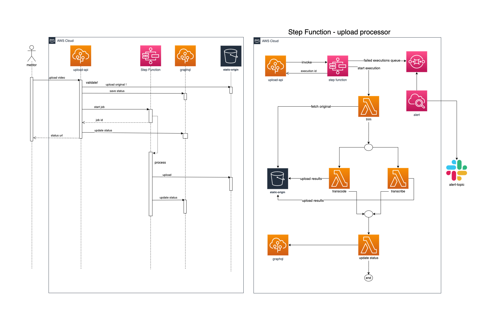

# Intro

This is a serverless service that can transcode and transcribe mentorpal answer uploads:



# Deployment instructions

## Setting up a cicd pipeline

Go to the ./infrastructure folder, create secret.tfvars file and then run:
```
aws s3api create-bucket --bucket mentorpal-upload-processor-tf-state-us-east-1 --region us-east-1
terraform init
terraform plan -lock=false -var-file=secret.tfvars --out=cicd
terraform apply -lock=false "cicd"
```

# Deploy

## api domain name

This must be done just once manually! 
To create the domain name mapping run this command just once:

```
sls create_domain --stage <prod|qa|dev> --region <region>
```


## Manual deploy

To deploy manually appropriate credentials are required.
First run once `npm ci` to get all the tools and then:

```
sls deploy -s <stage> --region <region>
# where stage is one of dev|qa|prod
```

## Manual test 

To test the api via api gateway (dev is the stage, <id> is the getway id):

```bash
curl -H "Authorization: Bearer ey***" https://<id>.execute-api.us-east-1.amazonaws.com/dev/thumbnail \
-F body='{"mentor":"6196af5e068d43dc686194f8"}' -F thumbnail=@profile.png
curl -H "Authorization: Bearer ey***" -H "Content-Type: application/json" https://<id>.execute-api.us-east-1.amazonaws.com/dev/transfer/mentor --data-binary "@sample-payload.json"
curl -H "Authorization: Bearer ey***" https://<id>.execute-api.us-east-1.amazonaws.com/dev/status/5e09da8f-d8cc-4d19-80d8-d94b28741a58
```

# Monitoring

All lambdas use sentry to report issues. If processing fails, SQS will move messages to corresponding DLQ,
and there're alarms that monitor DLQs and send message to an alerting SNS topic (currently forwards to slack).

# Troubleshooting

## Failed upload jobs

To retry processing after fixing a bug, go to 
(AWS Step Functions console)[https://us-east-1.console.aws.amazon.com/states/home]
pick and restart the failed execution. This requires an existing task status in graphql!

## Deploy fails when changing transcribe job lambdas

Got this deploy error when switching to Step Functions:

```
  An error occurred: StepUnderscoretranscribeUnderscorecollectCustomS31 - Received response status [FAILED] from custom resource. Message returned: Configuration is ambiguously defined. Cannot have overlapping suffixes in two rules if the prefixes are overlapping for the same event type. See details in CloudWatch Log: 2022/07/29/[$LATEST]adcecc9d361b475980af6ed5968358c1 (RequestId: 5340e709-d968-4dd0-86bd-e5719130811f).
```

Seems like a CloudFormation bug - it doesn't remove previous lambda's transcribe output bucket event notifications,
so then it fails to create the same for a new lambda. The solution was to remove event notifications manually and re-deploy.

# 

# Running locally

https://ffmpy.readthedocs.io/en/latest/ is used to transcode videos for mobile and web. 
Install ffmpeg locally first:

```bash
brew install ffmpeg
```
and make sure to adjust the FFMPEG_EXECUTABLE envvar.

## Asynchronous triggers

In order to run lambda handlers locally, you just need an event payload `*event.json` file.
There's a few in the `./__events__` folder:

```bash
sls invoke --local -f <function> -p __events__/<event.json.dist>
```


**Example**

```
# answer-upload.py -> handler to test
# answer-upload-event.event.json -> your local copy of event.json.dist, which is ignored by git
# answer-upload-event.event.json.dist -> reference event for other developers to be copied and used locally
sls invoke --local -f http_answer_upload -p __events__/answer-upload-event.event.json.dist
```

To debug in VS Code, use this config:

```json
{
  "version": "0.2.0",
  "configurations": [
    {
      "name": "Python: Current File",
      "type": "python",
      "request": "launch",
      "program": "${file}",
      "justMyCode": false,
      "env": {
        "S3_STATIC_ARN": "arn:aws:s3:::static-mentorpal-v2-mentorpal-origin",
        "GRAPHQL_ENDPOINT": "http://127.0.0.1:3001/graphql",
        "FFMPEG_EXECUTABLE": "ffmpeg",
        "API_SECRET": "secret",
        "STATIC_AWS_ACCESS_KEY_ID": "secret",
        "STATIC_AWS_REGION": "us-east-1",
        "AWS_REGION": "us-east-1",
        "STATIC_AWS_S3_BUCKET": "static-mentorpal-v2-mentorpal-origin",
        "STATIC_AWS_SECRET_ACCESS_KEY": "secret",
        "TRANSCRIBE_INPUT_BUCKET": "mentorpal-upload-sm-transcribe-input-dev",
        "TRANSCRIBE_OUTPUT_BUCKET": "mentorpal-upload-sm-transcribe-output-dev"
      },
      "console": "integratedTerminal"
    }
  ]
}
```

# Tech debt

- [ ] integration tests
- [ ] xray
- [ ] put all *.py files into src/app ?
- [ ] sls offline
- [x] cicd pipeline
